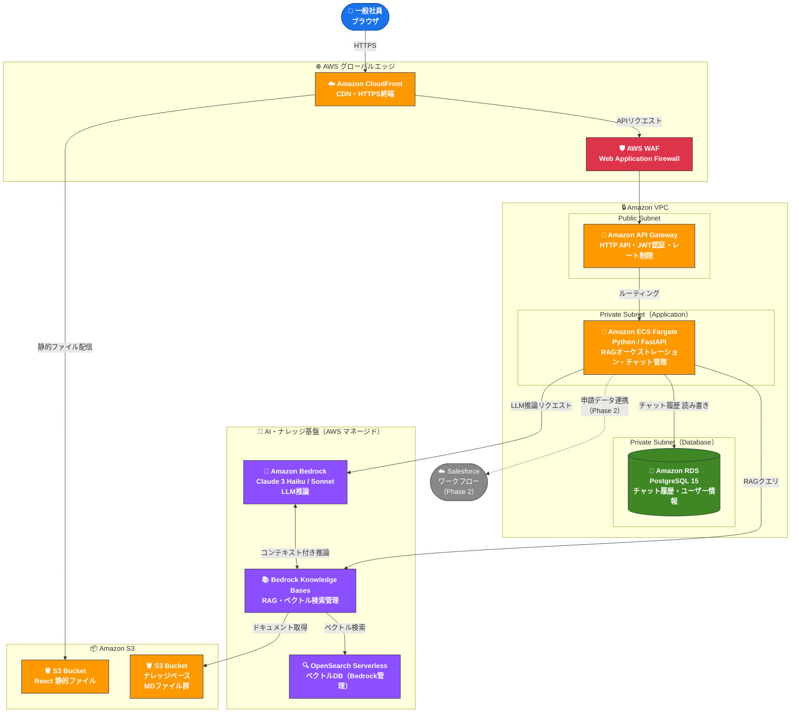
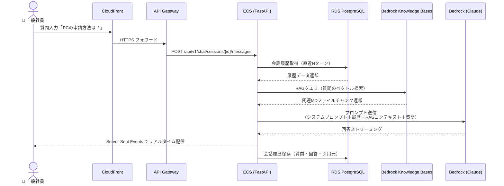
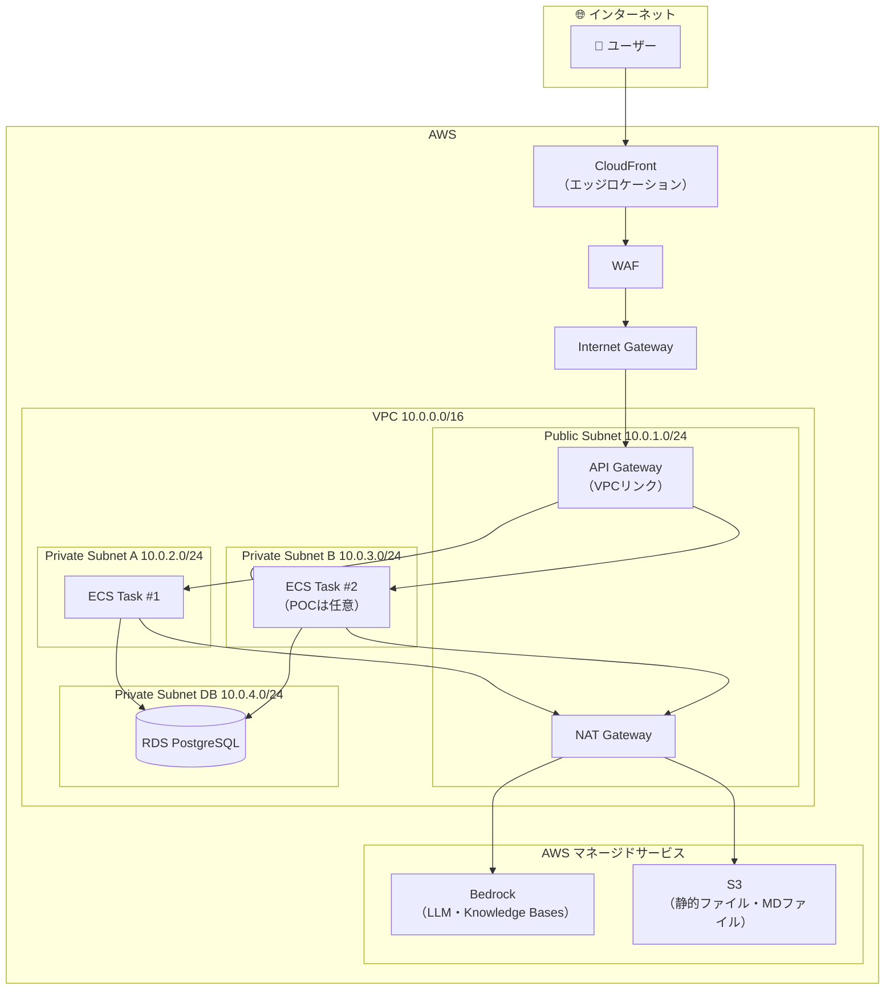
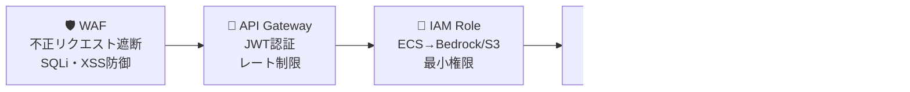

# ITヘルプデスク AIチャットボット アーキテクチャ図

**フェーズ**: POC  
**作成日**: 2026-04-07

---

## 1. システム全体アーキテクチャ

---

## 2. リクエスト・データフロー（シーケンス図）

---

## 3. ネットワーク構成

---

## 4. セキュリティレイヤー

---

## 5. コンポーネント一覧

| サービス | 役割 | POC設定 |
|---|---|---|
| **Amazon CloudFront** | CDN・HTTPS終端・キャッシュ | 1ディストリビューション |
| **AWS WAF** | SQLi・XSS・不正アクセス防御 | CloudFrontに紐付け |
| **Amazon API Gateway** | HTTPルーティング・JWT認証・レート制限 | HTTP API |
| **Amazon ECS Fargate** | Python/FastAPIコンテナ実行 | 1タスク（0.5vCPU / 1GB） |
| **Amazon RDS PostgreSQL** | チャット履歴・ユーザー情報 | db.t3.micro / Single-AZ |
| **Amazon S3**（静的） | React ビルド成果物のホスティング | 1バケット |
| **Amazon S3**（KB） | MDファイルのナレッジソース | 1バケット |
| **Amazon Bedrock Knowledge Bases** | RAGパイプライン・ベクトル検索管理 | Titan Embeddings V2 |
| **Amazon OpenSearch Serverless** | ベクトルDB（Bedrock自動管理） | Bedrock KB に紐付け |
| **Amazon Bedrock（Claude）** | LLM推論エンジン | Claude 3 Haiku（POCコスト優先）|

---

## 6. POC → 本番 移行ポイント

| 項目 | POC | 本番 |
|---|---|---|
| ECS タスク数 | 1 | Auto Scaling（2〜10） |
| RDS | Single-AZ / db.t3.micro | Multi-AZ / db.t3.medium〜 |
| 認証 | 簡易JWT | Amazon Cognito / 社内IdP連携 |
| Bedrock モデル | Claude 3 Haiku | Claude 3 Sonnet（精度優先） |
| 監視 | CloudWatch 基本メトリクス | CloudWatch Alarms + ダッシュボード |

---

*アイコン凡例: 🧠 AI/ML | 🐳 コンテナ | 🐘 DB | 🪣 ストレージ | 🔀 ネットワーク | 🛡️ セキュリティ*
