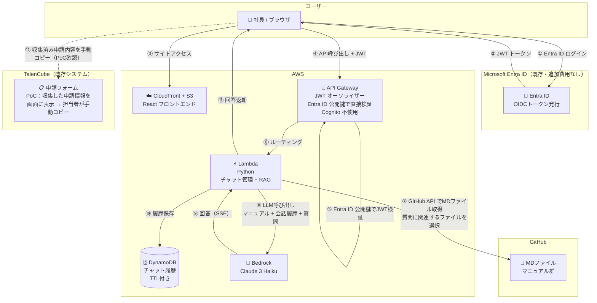
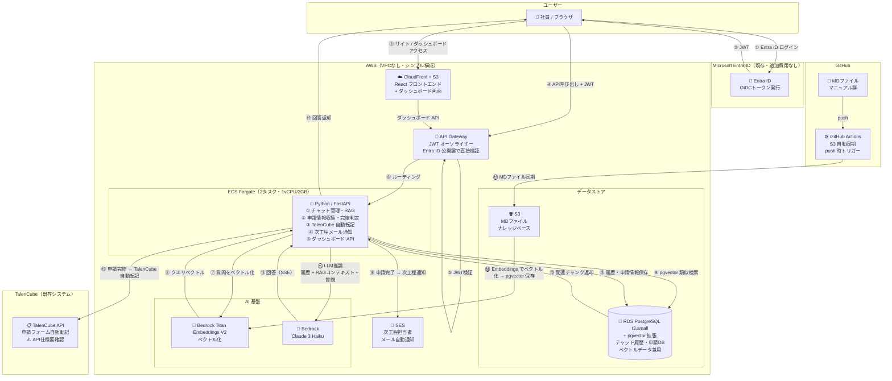
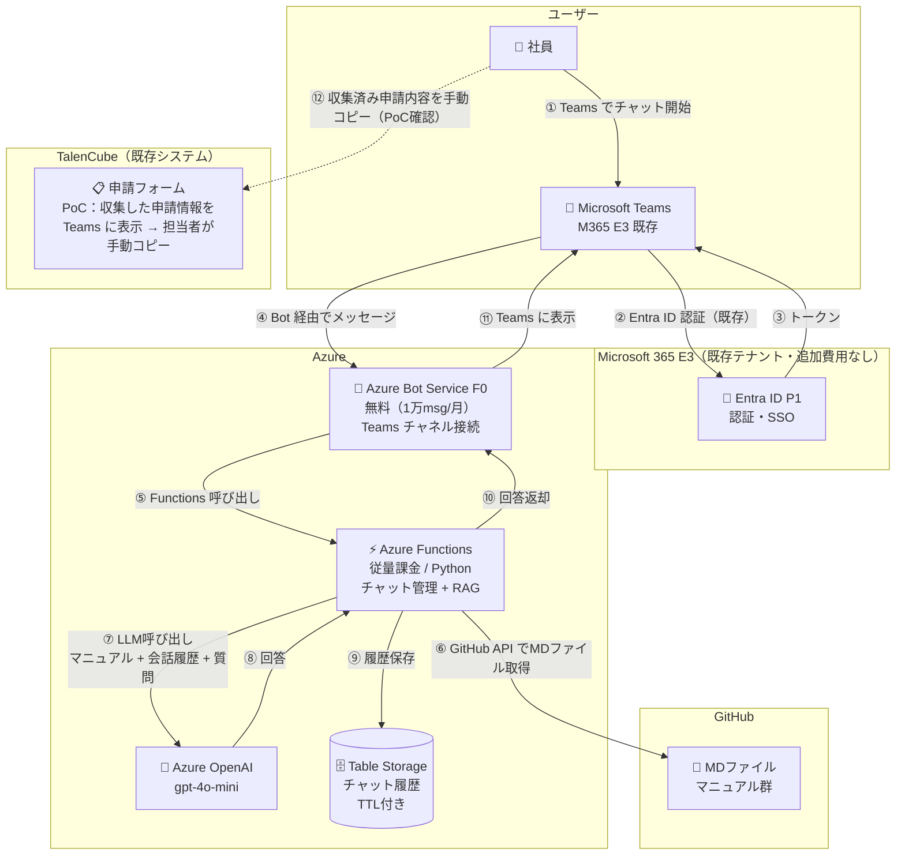
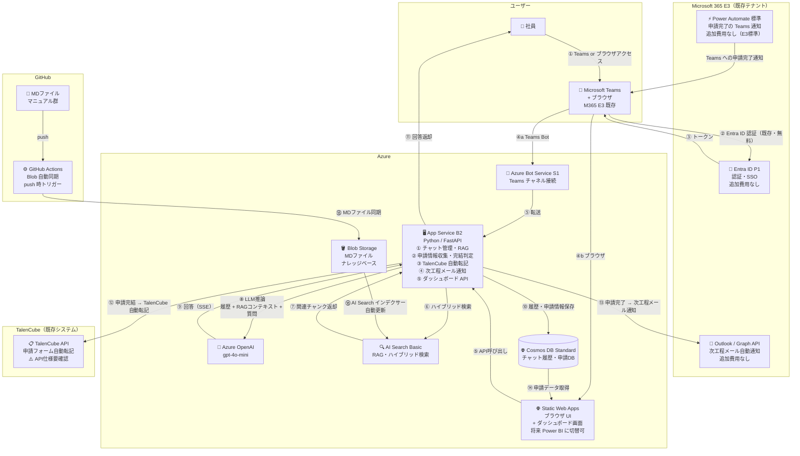

# 業務申請 AI チャットボット 統合仕様書

**バージョン**: 1.0.0  
**作成日**: 2026-04-20  
**ステータス**: 検討中（プラットフォーム選定前）

---

## 1. プロジェクト概要

### 1.1 背景・目的

IT情報システム部では、IT機器貸与・返却・変更依頼（使用者変更・経費負担部門変更・貸与延長）の申請をWEBシステム（TalenCube）で受け付けているが、申請後の受付確認・内容照合・次工程への引き継ぎがほぼ手入力・手動対応になっており、担当者の工数が大きくかかっている。

本プロジェクトでは、AIチャットボットを通じて申請者から過不足なく情報を収集し、TalenCubeの申請フォームへ自動転記・次工程担当者への自動通知を実現することで、申請受付業務の自動化と工数削減を目指す。

### 1.2 対象業務

| 業務区分 | 内容 |
|---|---|
| 機器貸与 | PCおよびスマートフォン等のIT機器貸与申請 |
| 機器返却 | 貸与機器の返却申請（ORC返却・YLC返却・廃棄） |
| 変更依頼 | 使用者変更・経費負担部門変更・機器貸与延長・周辺機器変更 |

### 1.3 対象ユーザー

| ユーザー区分 | 説明 |
|---|---|
| 一般社員（申請者） | PC・通信機器等の利用申請を行う従業員 |
| ITヘルプデスク担当者 | 申請受付・照合・次工程対応を行う担当者（工数削減の主対象） |
| 管理者 | ナレッジベース（MDファイル）の管理者（将来フェーズ） |

---

## 2. 機能要件

### 2.1 チャット機能

| 機能ID | 機能名 | 説明 | Step 1 | Step 3 |
|---|---|---|---|---|
| CHAT-01 | 対話形式 Q&A | MDマニュアルを参照してユーザーの質問に回答する | ◎ 必須 | ◎ 必須 |
| CHAT-02 | チャット履歴保持 | セッション内・跨ぎでの会話履歴を保持する | ◎ 必須 | ◎ 必須 |
| CHAT-03 | ストリーミング応答 | 回答をリアルタイムにストリーミング表示する | △ 推奨 | ◎ 必須 |
| CHAT-04 | 引用元表示 | 回答根拠となった MDファイル名・箇所を表示する | ✗ 対象外 | △ 推奨 |

### 2.2 申請支援機能

| 機能ID | 機能名 | 説明 | Step 1 | Step 3 |
|---|---|---|---|---|
| APP-01 | 申請情報収集 | AIとの対話を通じて申請に必要な情報を過不足なく収集する | ◎ 必須 | ◎ 必須 |
| APP-02 | 申請完結判定 | 必要情報が揃ったかをAIが判定し、申請確認をユーザーに提示する | ◎ 必須 | ◎ 必須 |
| APP-03 | TalenCube 自動転記 | 収集した申請情報を TalenCube の申請フォームへ自動転記する | ✗ 手動確認 | ◎ 必須 |
| APP-04 | 次工程メール通知 | 申請完了後に次工程担当者へ自動でメール通知する | ✗ 対象外 | ◎ 必須 |
| APP-05 | 申請履歴保持 | 申請内容・ステータスを履歴として保持する | △ 簡易 | ◎ 必須 |

### 2.3 ユーザー管理機能

| 機能ID | 機能名 | 説明 | Step 1 | Step 3 |
|---|---|---|---|---|
| USER-01 | ユーザー認証 | Entra ID（M365既存）によるSSOログイン | ◎ 必須 | ◎ 必須 |
| USER-02 | セッション管理 | セッションタイムアウト・ログアウト | ◎ 必須 | ◎ 必須 |
| USER-03 | 履歴削除 | ユーザーが自身のチャット履歴を削除できる | ✗ 対象外 | ◎ 必須 |

### 2.4 ダッシュボード機能

| 機能ID | 機能名 | 説明 | Step 1 | Step 3 |
|---|---|---|---|---|
| DASH-01 | 申請一覧 | 申請内容・申請者・日時の一覧表示 | ✗ 対象外 | ◎ 必須 |
| DASH-02 | ステータス管理 | 各申請の進捗ステータスを確認・更新できる | ✗ 対象外 | ◎ 必須 |
| DASH-03 | Power BI 連携 | Power BI によるダッシュボードへの切り替え | ✗ 対象外 | ✗ 将来追加 |

### 2.5 ナレッジベース管理機能

| 機能ID | 機能名 | 説明 | Step 1 | Step 3 |
|---|---|---|---|---|
| KB-01 | GitHub 連携 | GitHub リポジトリの MD ファイルをナレッジソースとして利用 | ◎ 必須 | ◎ 必須 |
| KB-02 | 自動インデックス更新 | GitHub push 時に CI/CD でナレッジベースを自動更新する | ✗ 手動 | ◎ 必須 |
| KB-03 | チャット履歴エクスポート | 会話履歴を Markdown 形式でダウンロードする | ✗ 対象外 | △ 推奨 |

---

## 3. 非機能要件

### 3.1 パフォーマンス

| 項目 | Step 1 目標 | Step 3 目標 |
|---|---|---|
| チャット応答開始（TTFB） | 5秒以内 | 3秒以内 |
| 同時接続ユーザー数 | 〜5名 | 〜30名 |
| 月間 LLM リクエスト数 | 〜600回 | 〜5,000回 |

### 3.2 セキュリティ

| 項目 | 方針 |
|---|---|
| 通信暗号化 | HTTPS（TLS 1.2以上） |
| 認証 | Entra ID（M365既存）による SSO。JWT トークン検証 |
| ネットワーク | セキュリティグループ + HTTPS で対応。WAF・ファイアウォールは不要 |
| データ保護 | DB暗号化・S3/Blob 暗号化（SSE） |
| アクセス制御 | IAM ロール / マネージドID による最小権限制御 |

### 3.3 可用性（PoC スコープ）

- Step 1：単一インスタンス（冗長なし）
- Step 3：最小 2 タスク / インスタンス構成

---

## 4. 段階的開発計画

### 4.1 フェーズ概要

| フェーズ | 目的 | 期間 | アクセス数 | 申請数 |
|---|---|---|---|---|
| **Step 1（PoC）** | AI会話品質・申請情報収集精度の検証。業務要件・機能要件の整理・追加 | 約1週間 | 〜10名 | テスト 20回/日程度 |
| **Step 2（開発初期〜中期）** | 機能実装・TalenCube連携テスト。業務・機能要件のさらなる追加・調整 | 約2週間 | 〜10名 | テスト 20回/日程度 |
| **Step 3（開発後期）** | 100名・月1,000件対応のチューニング。確定した要件の精度・速度最適化 | 継続運用 | 〜100名 | 1,000件/月（1件あたり5ラリー想定） |

### 4.2 Step 別の実装スコープ

```
Step 1（PoC）
  ├── AIチャット + RAG（プロンプト直接注入）
  ├── 申請情報収集・表示（手動コピー確認）
  ├── チャット履歴保持（簡易）
  └── Entra ID 認証

Step 2（開発初期〜中期）
  ├── 本格 RAG 実装（ベクトル検索）
  ├── TalenCube API 連携実装（⚠️ API仕様確認後）
  ├── 次工程メール通知
  └── チャット履歴エクスポート

Step 3（開発後期）
  ├── ダッシュボード実装（申請一覧・ステータス管理）
  ├── GitHub Actions による KB 自動同期
  ├── ストリーミング応答の最適化
  └── 100名・月1,000件対応チューニング
```

---

## 5. ライセンス・前提環境

### 5.1 既存ライセンス

| ライセンス | 内容 | このプロジェクトでの用途 |
|---|---|---|
| **Microsoft 365 E3** | Teams・Entra ID P1・Outlook・Power Automate（標準）・SharePoint | 認証・UI・通知・ワークフロー |
| **GitHub** | コード管理・GitHub Actions | ソースコード管理・CI/CD・MD自動同期 |

### 5.2 追加で必要なライセンス・サービス

| サービス | 用途 | 費用 | 備考 |
|---|---|---|---|
| **Azure サブスクリプション** | Azure OpenAI・App Service・AI Search 等 | 従量課金 | Azure 選択時に必要 |
| **AWS アカウント** | ECS・Bedrock・RDS 等 | 従量課金 | AWS 選択時に必要 |
| **Azure OpenAI 利用申請** | GPT-4o-mini の利用 | $0（申請自体は無料） | ⚠️ 事前申請が必要（数日かかる場合あり） |

### 5.3 将来追加予定のライセンス

| ライセンス | 用途 | 費用 |
|---|---|---|
| **Power BI Pro**（E3追加） | ダッシュボードの Power BI 移行時 | $10/ユーザー/月 |
| **Power Automate Premium**（条件付き） | TalenCube連携を Power Automate で実装する場合 | $15/ユーザー/月（バックエンドHTTP POSTで代替すれば不要） |

---

## 6. AWS 構成

### 6.1 Step 1 ― PoC

**方針：** Lambda のみ・VPC なし・RAG はプロンプト直接注入・Cognito 不使用



**コンポーネント一覧**

| サービス | 役割 | 設定 |
|---|---|---|
| CloudFront + S3 | React フロントエンド配信 | 1 ディストリビューション |
| API Gateway（HTTP API） | JWT 検証・ルーティング | Entra ID 公開鍵エンドポイント指定 |
| Lambda（Python） | チャット管理・GitHub API 呼び出し・LLM 呼び出し | メモリ 512MB・タイムアウト 30秒 |
| DynamoDB | チャット履歴（TTL 30日） | オンデマンド |
| Bedrock Claude 3 Haiku | LLM 推論 | 東京リージョン |
| Entra ID（M365既存） | OIDC 認証 | アプリ登録のみ（追加費用なし） |

**月額コスト概算：〜$7〜15/月**

| サービス | 月額 |
|---|---|
| CloudFront + S3 | ~$1 |
| API Gateway | ~$1 |
| Lambda | ~$0（無料枠内） |
| DynamoDB | ~$1 |
| Bedrock Claude 3 Haiku（600回/月） | ~$4 |
| **合計** | **~$7〜15** |

---

### 6.2 Step 3 ― 開発後期

**方針：** ECS Fargate・カスタム RAG（pgvector）・OpenSearch 不使用・VPC なしシンプル構成



**カスタム RAG フロー（pgvector）**

```
【インデックス時 — GitHub push → 自動実行】
MDファイル更新（GitHub）
  → GitHub Actions が S3 へ同期
  → ECS 同期ジョブが起動
  → Bedrock Titan Embeddings でチャンク化・ベクトル化（512 tokens・20% overlap）
  → RDS pgvector に保存

【クエリ時 — ユーザー質問ごと】
ユーザー質問
  → Titan Embeddings でクエリベクトル化
  → pgvector で類似度検索（Top-5 チャンク取得）
  → Claude に「システムプロンプト + RAGコンテキスト + 会話履歴 + 質問」として渡す
  → 回答を SSE でストリーミング返却
```

**コンポーネント一覧**

| サービス | 役割 | 設定 |
|---|---|---|
| CloudFront + S3 | フロントエンド + ダッシュボード配信 | 1 ディストリビューション |
| API Gateway（HTTP API） | JWT 検証・ルーティング | Entra ID 公開鍵エンドポイント指定 |
| ECS Fargate | Python / FastAPI バックエンド | 2 タスク・1vCPU/2GB |
| RDS PostgreSQL t3.small + pgvector | チャット履歴・申請DB・ベクトルDB | Single-AZ（PoC）|
| S3（KB用） | MD ファイルナレッジベース | 1 バケット |
| Bedrock Titan Embeddings V2 | ベクトル化 | |
| Bedrock Claude 3 Haiku | LLM 推論 | 精度不足時 Sonnet へ切替検討 |
| SES | 次工程担当者へのメール通知 | |
| GitHub Actions | S3 自動同期・CI/CD | push 時トリガー |
| Entra ID（M365既存） | OIDC 認証 | Cognito 不使用 |

**月額コスト概算：〜$114〜180/月**

| サービス | 月額 | 備考 |
|---|---|---|
| CloudFront + S3 | ~$3 | |
| API Gateway | ~$1 | |
| ECS Fargate（2タスク） | ~$71 | 1vCPU/2GB × 2 |
| RDS PostgreSQL t3.small + pgvector | ~$30 | OpenSearch Serverless（$345/月）を回避 |
| Bedrock Titan Embeddings V2 | ~$2 | |
| Bedrock Claude 3 Haiku（5,000回/月） | ~$6 | |
| SES | ~$1 | |
| **合計** | **~$114〜180** | |

---

## 7. Azure 構成

### 7.1 Step 1 ― PoC

**方針：** Teams Bot + Azure Functions + M365 既存リソース最大活用・AI Search 不使用



**コンポーネント一覧**

| サービス | 役割 | 設定 |
|---|---|---|
| Azure Bot Service F0 | Teams チャネル接続 | 無料（1万 msg/月まで） |
| Azure Functions（従量課金） | チャット管理・GitHub API 呼び出し・LLM 呼び出し | Python・消費プラン |
| Azure OpenAI gpt-4o-mini | LLM 推論 | Japan East |
| Table Storage | チャット履歴（TTL 30日） | Standard LRS |
| Entra ID（M365 E3 既存） | 認証・SSO | 追加費用なし |
| Teams（M365 E3 既存） | チャットボット UI | 追加費用なし |

**月額コスト概算：〜$2〜10/月**

| サービス | 月額 |
|---|---|
| Azure Bot Service F0 | $0 |
| Azure Functions（従量課金） | ~$0（無料枠内） |
| Azure OpenAI gpt-4o-mini（600回/月） | ~$1 |
| Table Storage | ~$1 |
| Entra ID / Teams | $0（M365 E3 既存） |
| **合計** | **~$2〜10** |

---

### 7.2 Step 3 ― 開発後期

**方針：** M365 E3 最大活用・AI Search で本格 RAG・ダッシュボードはカスタム React（Power BI は将来追加）



**コンポーネント一覧**

| サービス | 役割 | 設定 |
|---|---|---|
| Static Web Apps Standard | ブラウザ UI + ダッシュボード | $9/月 |
| Azure Bot Service S1 | Teams チャネル接続 | 〜5万 msg/月 |
| App Service B2 | Python / FastAPI バックエンド | 2vCPU / 3.5GB |
| Azure OpenAI gpt-4o-mini | LLM 推論 | Japan East・精度不足時 gpt-4o へ切替検討 |
| AI Search Basic | RAG・ハイブリッド検索 | 3 QPS（100名規模で十分） |
| Blob Storage | MD ファイルナレッジベース | Standard LRS |
| Cosmos DB Standard 400RU/s | チャット履歴・申請 DB | |
| Entra ID / Outlook / Power Automate | 認証・通知・ワークフロー | M365 E3 既存・追加費用なし |
| GitHub Actions | Blob 自動同期・CI/CD | push 時トリガー |

**月額コスト概算：〜$190〜210/月**

| サービス | 月額 | 備考 |
|---|---|---|
| Static Web Apps Standard | ~$9 | |
| Azure Bot Service S1 | ~$7 | |
| App Service B2 | ~$72 | |
| Azure OpenAI gpt-4o-mini（5,000回/月） | ~$3 | |
| AI Search Basic | ~$73 | RAG の固定費 |
| Blob Storage | ~$1 | |
| Cosmos DB Standard | ~$25 | |
| Entra ID / Outlook / Power Automate | $0 | M365 E3 既存 |
| **合計** | **~$190〜210** | Power BI なし（将来追加） |

---

## 8. コスト・構成比較

### 8.1 月額コスト比較

| | Step 1（PoC） | Step 3（開発後期） |
|---|---|---|
| **AWS** | **~$7〜15/月** | **~$114〜180/月** |
| **Azure** | **~$2〜10/月** | **~$190〜210/月** |
| 差額 | 同等 | AWS が約 $70〜90 安い（AI Search 固定費が主因） |

### 8.2 構成比較

| 観点 | AWS | Azure |
|---|---|---|
| 認証管理工数 | ほぼゼロ（Entra ID OIDC 直接検証） | ゼロ（M365 既存テナント） |
| Teams UI | 別途構成が必要 | Bot Service でネイティブ対応 |
| メール通知 | SES（実装必要） | Outlook Graph API（M365 既存・追加費用なし） |
| ワークフロー通知 | 別途実装 | Power Automate（M365 E3 標準・追加費用なし） |
| RAG 実装 | pgvector（カスタムコード必要） | AI Search（インデクサー設定のみ・マネージド） |
| ダッシュボード | カスタム React | カスタム React → 将来 Power BI 移行が容易 |
| 開発・保守スキル | Python + AWS + Entra ID | Python + Azure（M365 管理者が兼任可） |
| Step 3 コスト | ◎ 安い（$114〜180） | △ やや高い（$190〜210）|

### 8.3 プラットフォーム選択の判断軸

| 優先事項 | 推奨 |
|---|---|
| Teams をメイン UI として使いたい | **Azure** |
| M365 の通知・ワークフローをそのまま活用したい | **Azure** |
| Step 3 のランニングコストを最小化したい | **AWS** |
| RAG の保守工数を減らしたい（マネージド優先） | **Azure**（AI Search） |
| M365 管理者がインフラを兼任する想定 | **Azure** |

---

## 9. Step 1 → Step 3 移行ポイント

### AWS

| コンポーネント | Step 1 | Step 3 |
|---|---|---|
| バックエンド | Lambda | ECS Fargate × 2タスク |
| RAG | プロンプト直接注入 | pgvector + Titan Embeddings |
| DB | DynamoDB | RDS PostgreSQL + pgvector |
| 認証 | 同じ（変更なし） | 同じ（変更なし） |
| TalenCube | 手動コピー | HTTP POST 自動転記 |
| 通知 | なし | SES |
| ダッシュボード | なし | カスタム React |

### Azure

| コンポーネント | Step 1 | Step 3 |
|---|---|---|
| バックエンド | Azure Functions | App Service B2 |
| RAG | プロンプト直接注入 | AI Search Basic |
| DB | Table Storage | Cosmos DB Standard |
| UI | Teams のみ | Teams + Static Web Apps |
| 認証 | 同じ（変更なし） | 同じ（変更なし） |
| TalenCube | 手動コピー | HTTP POST 自動転記 |
| 通知 | なし | Outlook Graph API + Power Automate |
| ダッシュボード | なし | カスタム React（将来 Power BI 追加） |

---

## 10. 将来拡張計画

| 項目 | 内容 | 条件 |
|---|---|---|
| **Power BI ダッシュボード** | カスタムReactダッシュボードをPower BIに切り替え | M365 E3 に Power BI Pro 追加（$10/ユーザー/月）または E5 移行時 |
| **Salesforce / TalenCube Phase 2** | チャットで収集した申請情報をワークフローへ自動投入（現行TalenCube APIで対応できない場合） | TalenCube API仕様確認後 |
| **管理者向けナレッジ管理UI** | MDファイルのアップロード・編集・インデックス管理画面 | Step 3 安定運用後 |
| **LLM モデルのアップグレード** | Claude 3 Haiku → Sonnet / gpt-4o-mini → gpt-4o | 精度不足と判断された場合 |

---

## 11. 前提・制約・リスク

| 項目 | 内容 | 対応方針 |
|---|---|---|
| ⚠️ **TalenCube REST API** | 公開されているか・認証方式・エンドポイント仕様が未確認 | **Step 1 開始前に確認必須**。API 非公開の場合は RPA / ブラウザ自動操作で代替検討 |
| ⚠️ **Azure OpenAI 利用申請** | Azure OpenAI は事前申請が必要（数日〜数週間かかる場合あり） | Azure 選択時は Step 1 開始前に申請しておく |
| ⚠️ **申請フォーム項目定義** | AI が収集すべき情報の完全リストが未定義 | Step 1 で業務担当者とともに確定する |
| **M365 テナント変更の波及** | 条件付きアクセス変更・MFA 強化があると認証設定の見直しが必要 | AWS・Azure ともに Entra ID を流用するため同様にリスクあり |
| **PoCフェーズの制約** | 可用性・冗長性設計は Step 3 以降で対応 | Step 1〜2 は単一インスタンス構成 |
